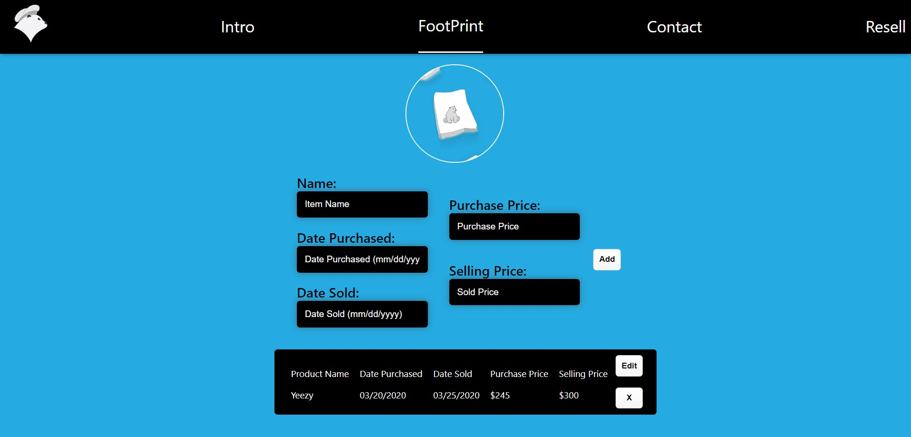

# Polar Footprints API

Polar Footprints API controls the interactions between the front end and database.

## Technologies

Polar Footprints was built using Node, Express and knex. PostgreSQL was used to built the database.

## Client Repo

https://github.com/Joalvaca/Polar-Footprint.git

## Live Site

